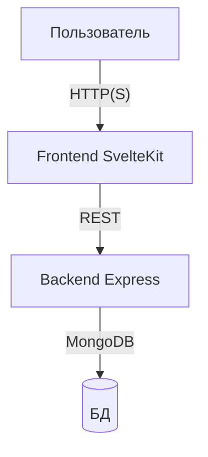

# BuildLinkFullstack

Моно-репозиторий для fullstack-проекта BuildLink: современный сервис объявлений с авторизацией, CRUD, поиском, тестами и современным UX.

---

## О проекте

BuildLink — учебно-боевой pet-проект для демонстрации лучших практик Node.js/Express, SvelteKit, MongoDB, TypeScript, E2E и unit-тестирования. Подходит как основа для реальных сервисов.

## Что нового

-   Просмотр чужого профиля по клику на ник (роут `/profile/[id]`)
-   Кликабельные ники пользователей в объявлениях
-   Современная сетка объявлений, адаптивный дизайн
-   Загрузка до 6 фото к объявлению, drag&drop, предпросмотр
-   Автоматическая синхронизация swagger-типов между backend и frontend
-   Улучшенный UX: быстрый переход между профилями, отдельные блоки для профиля и объявлений
-   Актуальные тесты (unit, e2e), строгий ESLint/Prettier

## Архитектура

-   **Backend**: REST API на Express + MongoDB, JWT-аутентификация, валидация, тесты (Jest, Supertest), Swagger
-   **Frontend**: SvelteKit, TailwindCSS, Playwright E2E, современный UI/UX, drag&drop загрузка фото
-   **Моно-репозиторий**: единый git, единые правила оформления, строгий ESLint/Prettier



## Основные возможности

-   Регистрация, вход, JWT-сессии
-   CRUD объявлений (создание, редактирование, удаление, просмотр)
-   Поиск и фильтрация
-   Защита API, валидация, обработка ошибок
-   E2E и unit-тесты, CI-ready
-   Просмотр чужого профиля и его объявлений
-   Загрузка/удаление аватара и фото объявлений (до 6)

## Технологии

-   Node.js 20+, Express, TypeScript, MongoDB, Mongoose
-   SvelteKit, TailwindCSS, Playwright, ESLint, Prettier
-   Jest, Supertest, mongodb-memory-server

## Быстрый старт

```bash
git clone https://github.com/FrankFMY/BuildLinkFullstack.git
cd BuildLinkFullstack
# Backend
cd Backend && npm install
# Svelte frontend
cd ../Svelte && npm install
```

Подробнее — в README модулей:

-   [Backend/README.md](./Backend/README.md)
-   [Svelte/README.md](./Svelte/README.md)

## Структура репозитория

-   `Backend/` — сервер, API, тесты, документация
-   `Svelte/` — клиент, UI, E2E, документация
-   `.gitignore`, `README.md` — служебные файлы

## Вклад и развитие

-   Любые PR приветствуются! Соблюдайте стиль, пишите тесты, не коммитьте секреты.
-   Вопросы и баги — через Issues.

## FAQ

-   **Где переменные окружения?** — В файлах `.env` (см. примеры в модулях)
-   **Как запустить тесты?** — `npm test` в нужном модуле
-   **Как деплоить?** — Любой Node.js-хостинг, MongoDB Atlas или локально

## Синхронизация типов API (OpenAPI → TypeScript)

После любых изменений API на бэкенде (новые поля, эндпоинты и т.д.) обязательно запускайте:

```
npm run swagger:sync
```

Это скачает свежий swagger.json и сгенерирует актуальные типы DTO для фронта в Svelte/src/types/api.d.ts.

Если типы не совпадают — не пушьте изменения, пока не синхронизируете!

---

_Проект для демонстрации fullstack-подхода. Используйте, дорабатывайте, делитесь опытом!_

## CI/CD

Автоматическая проверка кода и тестов реализована через GitHub Actions:

-   Проверяются оба пакета: Backend и Svelte (монорепозиторий)
-   Запуск: при push и pull request в ветки main и feature/\*
-   Проверки: установка зависимостей, линт, тесты, сборка
-   Используется Node.js 22, Ubuntu
-   Кэшируются зависимости для ускорения

Файл workflow: `.github/workflows/ci.yml`

Любой push/PR должен проходить все проверки без ошибок и предупреждений. Подробнее — см. package.json каждого пакета.

